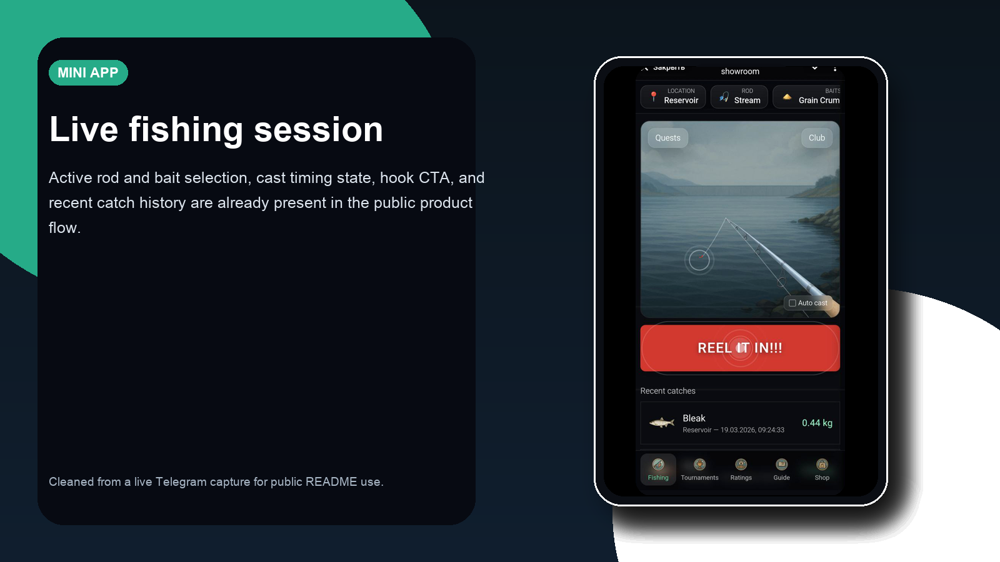
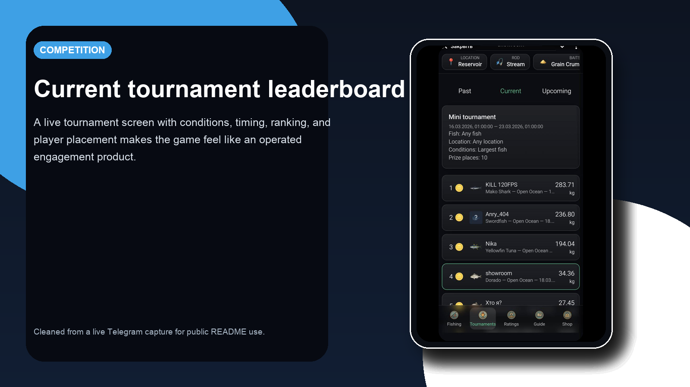
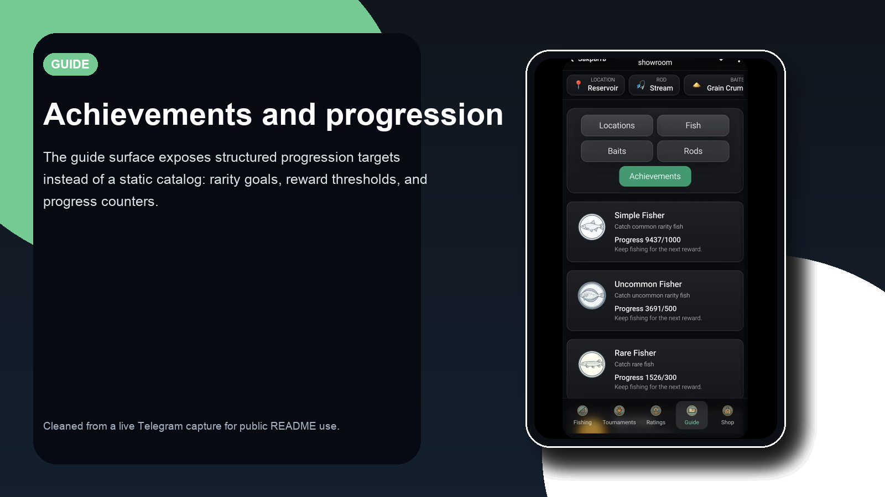
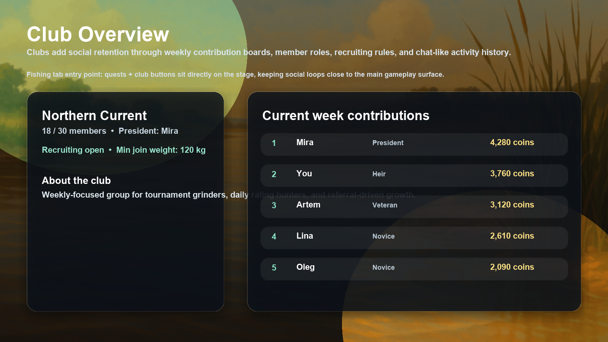
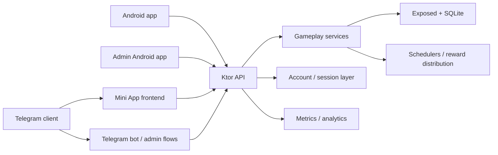
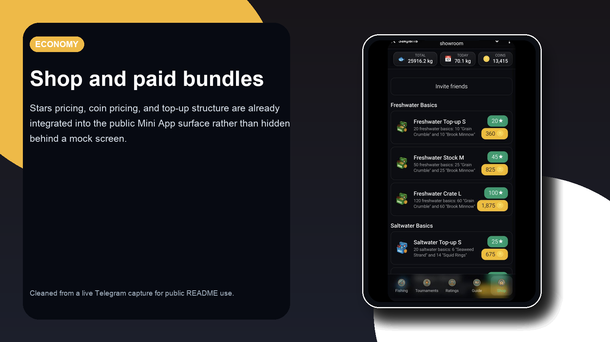
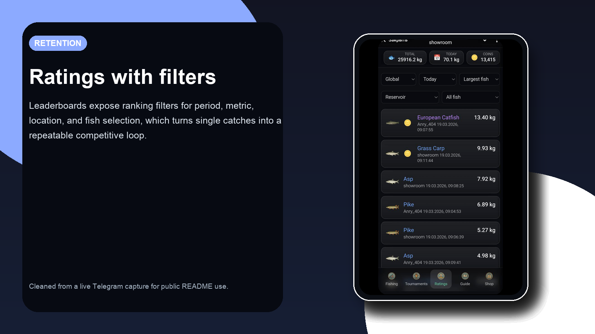
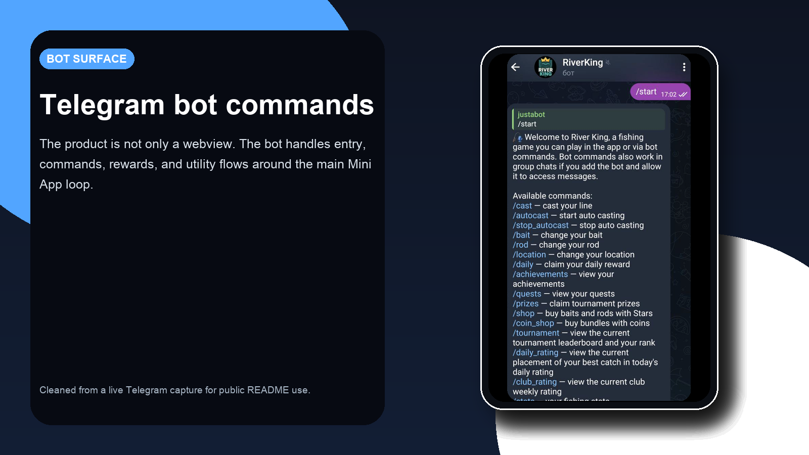

# RiverKing

RiverKing is a Telegram-first fishing game with a Kotlin/Ktor backend, a shipped Telegram Mini App frontend, Telegram bot flows, progression systems, regular tournaments, special club events, personal and club quests, clubs, referrals, and Stars-based monetization. The repository now also includes Android subtrees for the player client and an internal admin app.

It is built as a working product rather than a thin game prototype: the repository already includes session-authenticated Mini App flows, real gameplay systems, persistent progression, background jobs, operational metrics, moderation rules, admin-side bot tooling, and a protected mobile admin surface.

**What it does**

- Delivers an always-on immersive fishing scene in the Telegram Mini App and Android, with cast, hook, revealed hooked fish, and dynamic tap-to-land challenges.
- Tracks progression across locations, rods, lures, fish discovery, achievements, quests, tournaments, and clubs.
- Adds special club events in the Telegram Mini App and Android client: temporary event locations, club total-weight/count leaderboards, personal top-fish leaderboards, and event prize delivery.
- Ships daily and weekly personal quests plus weekly club quests with pooled progress and split coin rewards for current club members.
- Club screens in the Telegram Mini App and Android client now switch between weekly contribution ratings, weekly club quests, and a shared club chat feed, with per-member contribution views for each active club quest.
- Connects the game backend to Telegram bot commands, referral flows, Stars payments, coin purchases, auto-casting, and operational metrics.
- Includes an Android nested project under `mobile/android-app` with shared-backend auth, `play`/`direct` flavors, real Google Play Billing for the `play` flavor, and a parity-focused mobile shell.
- Includes an internal Jetpack Compose admin app under `mobile/admin-app` for token-protected tournament, special-event, cast-zone, discount, and broadcast operations.

**Why it is technically interesting**

- Hybrid product surface: Mini App frontend, bot commands, Android player client, and internal admin flows in one codebase.
- Shared identity foundation: Telegram cookie sessions for the Mini App plus bearer-token mobile auth with Telegram sign-in/linking against the same gameplay API.
- Product-minded backend, not only a game loop: progression, retention systems, economy, moderation, payments, analytics, and scheduling.
- Clear Kotlin layers for Ktor routes, gameplay services, Exposed persistence, shipped frontend assets, and an isolated Android project.

**Stack**

`Kotlin` `Ktor` `Netty` `Exposed` `SQLite` `Telegram Mini App` `Telegram Bot API` `Android` `Jetpack Compose` `Admin API` `TG Analytics` `Gradle`

**Quick links**

- Mini App: [t.me/river_king_bot/app](https://t.me/river_king_bot/app)
- Bot: [t.me/river_king_bot](https://t.me/river_king_bot)
- Product overview: [docs/product-overview.md](docs/product-overview.md)
- Android release guide: [docs/android-release.md](docs/android-release.md)
- Architecture: [DOCUMENTATION.md](DOCUMENTATION.md)
- Agent guide: [AGENTS.md](AGENTS.md)

| Fishing | Tournaments |
| --- | --- |
|  |  |
| Achievements | Clubs |
|  |  |

Human-facing repository docs live in this file and in [docs/product-overview.md](docs/product-overview.md). AI-oriented repository context lives in [AGENTS.md](AGENTS.md), [DOCUMENTATION.md](DOCUMENTATION.md), and the package READMEs under `src/main/kotlin/**`.

## What I Built

- A Telegram Mini App with a fishing-first gameplay loop and a shipped asset-driven frontend.
- Ktor API routes for Telegram auth, profile state, fishing actions, guide data, ratings, regular tournaments, special club events, clubs, quests, shop, referrals, and prizes.
- Provider-neutral auth tables and routes for Telegram, Google sign-in, password auth, refresh sessions, and shared bearer access.
- Product systems for progression, achievements, quests, tournament and special-event prize logic, club competition, referral rewards, and in-game economy.
- Telegram bot integrations for commands, auto-casting, prize flows, payment-support flows, and admin operations.
- Exposed-backed persistence, startup restoration logic, background schedulers, TG Analytics integration, and Prometheus-style metrics.
- A nested Android project with its own Gradle setup, Telegram/password/Google auth flows, nickname gate, shared-API main shell, update prompts/mandatory upgrade blocking, and real Google Play Billing verification for the `play` flavor.
- A separate internal admin Android project with saved server profiles, bearer-token admin API access, tournament and special-event creation/deletion, cast-zone editing, shop discount management, and broadcast sending.
- Public Android-compliance surfaces for privacy, support, terms, and account deletion, plus an authenticated account deletion endpoint for mobile users.

## Architecture



- `src/main/kotlin/app/` owns bootstrap, sessions, Telegram auth, HTTP routes, bot webhook handling, and schedulers.
- `src/main/kotlin/service/` contains gameplay systems such as fishing, tournaments, special events, quests, clubs, referrals, achievements, and shop/payment logic.
- `src/main/kotlin/db/` defines tables, schema creation, seed data, and data migrations.
- `src/main/resources/webapp/` contains the shipped Mini App frontend and visual assets.
- `mobile/android-app/` contains the nested Android client project and its separate Gradle build.
- `mobile/admin-app/` contains the internal Android admin project and its separate Gradle build.

## Core Systems

- `Fishing loop`: cast -> hook -> revealed fish -> dynamic tap challenge -> catch with timing, aggressive fish struggle animation, catch presentation, and recent catch history.
- `Progression`: locations, rods, lures, fish discovery, unlocks, and recommendation logic.
- `Retention`: daily rewards, location-aware quest pools, achievements, daily ratings, regular tournaments, and special-event participation.
- `Social loops`: clubs, member roles, weekly contribution boards, shared club quests, special club-event competition, and club chat feed.
- `Economy`: Stars purchases, coin purchases, referral rewards, and prize distribution.
- `Operations`: profanity filtering, metrics, TG Analytics hooks, startup recovery, and scheduled background jobs.
- `Admin operations`: bot-side admin commands plus the internal admin Android app for tournaments, special events, cast zones, discounts, and broadcasts.

## Documentation Map

- [docs/product-overview.md](docs/product-overview.md): product-facing overview of game loops, economy, and operating model.
- [DOCUMENTATION.md](DOCUMENTATION.md): engineering architecture and package map.
- [AGENTS.md](AGENTS.md): repo-level guide for coding agents and review tools.
- [mobile/admin-app/README.md](mobile/admin-app/README.md): internal Android admin app setup and scope.
- Package READMEs:
  - [src/main/kotlin/app/README.md](src/main/kotlin/app/README.md)
  - [src/main/kotlin/service/README.md](src/main/kotlin/service/README.md)
  - [src/main/kotlin/db/README.md](src/main/kotlin/db/README.md)
  - [src/main/kotlin/util/README.md](src/main/kotlin/util/README.md)

## Demo / Screenshots

### Fishing home


### Guide / achievements


### Current tournament


### Club overview


### Shop and daily reward



### Ratings



### Bot flow



Admin-side tooling exists in bot flows and the internal Android admin app, but it is intentionally excluded from the public screenshot set.

## Setup

### Prerequisites

- JDK 17+
- Telegram bot token for real Telegram integration
- A writable SQLite path or another configured database target
- Android SDK, if you want to build the nested Android player client or admin app
- `ADMIN_API_TOKEN`, if you want to use the internal admin Android app

### Quick start

1. Copy the example config into the runtime location:

   ```bash
   cp config.example.properties src/main/resources/config.properties
   ```

2. For local development, at minimum keep these values:

   ```properties
   BOT_TOKEN=TEST
   BOT_NAME=river_king_bot
   PUBLIC_BASE_URL=http://localhost:8080
   DEV_MODE=true
   ```

3. Start the app:

   ```bash
   ./gradlew run
   ```

4. Open the Mini App locally:

   [http://localhost:8080/app](http://localhost:8080/app)

With `DEV_MODE=true`, the Mini App can boot without a real Telegram session and the API falls back to the local development user.
With `DEV_MODE=false`, opening `/app` in a regular browser keeps the Mini App blocked until valid Telegram `initData` is present.

To work on the Android player client, use [mobile/android-app/README.md](mobile/android-app/README.md). To work on the internal admin app, use [mobile/admin-app/README.md](mobile/admin-app/README.md).

## Configuration

Use [config.example.properties](config.example.properties) as the starting point. Current keys used by the app:

- `BOT_TOKEN`
- `BOT_NAME`
- `PUBLIC_BASE_URL`
- `RIVERKING_ITCH_PROJECT_URL`
- `RIVERKING_PLAY_STORE_URL`
- `RIVERKING_ANDROID_DIRECT_DOWNLOAD_URL`
- `DATABASE_URL`
- `DATABASE_USER`
- `DATABASE_PASSWORD`
- `PORT`
- `DEV_MODE`
- `ADMIN_TG_ID`
- `PROVIDER_TOKEN`
- `TELEGRAM_WEBHOOK_SECRET`
- `AUTH_TOKEN_SECRET`
- `AUTH_ACCESS_TOKEN_TTL_MINUTES`
- `AUTH_REFRESH_TOKEN_TTL_DAYS`
- `ADMIN_API_TOKEN`
- `GOOGLE_AUTH_CLIENT_ID`
- `GOOGLE_PLAY_PACKAGE_NAME`
- `GOOGLE_PLAY_SERVICE_ACCOUNT_FILE`
- `TG_ANALYTICS_TOKEN`
- `TG_ANALYTICS_SCRIPT_URL`
- `TG_ANALYTICS_APP_NAME`

## Checks

Build the application classes:

```bash
./gradlew classes
```

Run tests:

```bash
./gradlew test
```
